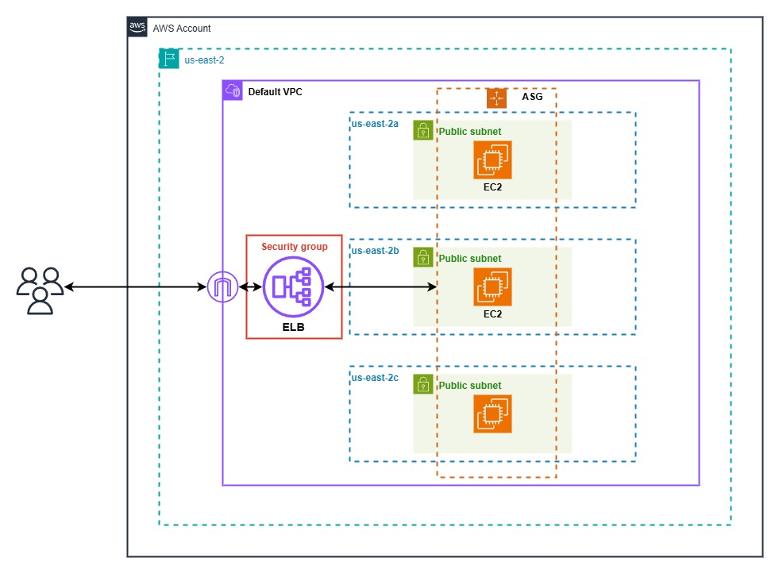

# Scalable Web Cluster Using AWS Elastic Load Balancer and Auto Scaling Group

This project uses Terraform to provision a scalable web cluster using AWS Elastic Load Balancer and Auto Scaling Group.

The infrastructure is provisioned in a single AWS region (us-east-2), using the 
default VPC and default subnets.

The cluster is made up of the following resources:
- Auto Scaling Group
- Application Load Balancer
- Security Groups
- EC2 Instances

# Elastic Load Balancer and Auto Scaling Group Architecture

